# Project Entreprise Development Experience: MuziekService (Eva Burghoorn & Kyara Van Genechten)
## Onderwerp van het project en de microservices
Het onderwerp van dit project is een streaming service voor muziek en deze is opgedeeld in 4 microservices. We hebben voor een muziekservice als onderwerp gekozen omdat wij dit allebei interessant vinden. Een muziekservice bestaat natuurlijk ook uit verschillende microservices, hieronder kan je onze 4 microservices opgesomd terugvinden: 

-	User-service 
-	MusicPodcast-service
-	Playlist-service
-	Rating-service
  
User-service heeft alles te maken met informatie over de gebruikers van de muziekservice. Je kunt een nieuwe gebruiker aanmaken, maar ook aanpassen, verwijderen en informatie van een specifieke gebruiker opvragen. 

MusicPodcast-service bevat alle liedjes en alle podcasts die op onze muziekservice te vinden zijn. Op deze microservice kan je alleen maar dingen opvragen zoals de liedjes, podcasts,...

Op de Playlist-service kan een gebruiker een nieuwe playlist aanmaken met verschillende liedjes en/of podcasts. 

Rating-service houdt alle beoordelingen bij voor de liedjes en/of podcasts die een gebruiker toekent. Natuurlijk kunnen deze aangemaakt worden, maar ook opgevraagd, aangepast of verwijderd worden.

Dit is kort uitgelegd wat deze muziekservice met de 4 microservices inhoudt.

## API Gateway
Wij hebben ook een api gateway geïmplementeerd als onderdeel van onze muziekservice. Het dient als een soort toegangspunt voor externe gebruikers, hier rond hoort onder andere ook de authentication, authorization, routing, security,...

Voor de authenticatie hebben wij GCP 0Auth2 geimplementeerd. Alle onze routes zijn beveiligd buiten het aanmaken van een gebruiker. Het creëren van een gebruiker kan je dus zonder authenticatie aanmaken. 

## Draw.io
Hieronder op de foto kan je ons draw.io schema terugvinden, hierop kan je dus zien hoe onze muziekservice er uitziet. 
Je kan hierop onze 4 microservices terugvinden, met de api gateway. Wij hebben ervoor gekozen om bij de playlist-service met een SQL database te werken en bij de andere 3 met een MongoDB database. Al onze endpoints zijn beveiligd buiten het aanmaken van een gebruiker met GCP OAuth2 zoals hierboven vermeld. Op de foto kan je dus duidelijk zien welke requests wij hebben gemaakt bij elke micro-service. Wij hebben in totaal 9 GET, 3 POST, 3 PUT en 3 DELETE endpoints. 

  
## Hosted Links
Hier onder kan je al onze micro-services en de api-gateway URL's zien die gehost zijn op Okteto.
API-gateway: https://api-gateway-evaburghoorn.cloud.okteto.net/

Playlist-service: https://playlist-service-evaburghoorn.cloud.okteto.net/

User-service: https://user-service-evaburghoorn.cloud.okteto.net/

MusicPodcast-service: https://musicpodcast-service-evaburghoorn.cloud.okteto.net/

Rating-service: https://rating-service-evaburghoorn.cloud.okteto.net/
  

## Endpoints in Postman
Hieronder kan je de foto's zien van de resultaten van de endpoints in Postman.

### Playlist-service: 
1. Get /playlist/all -> Geeft alle playlists terug
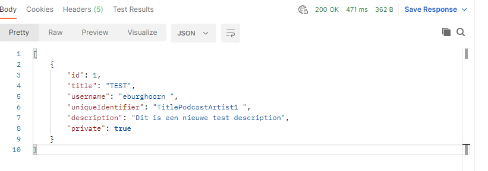

2. Get /playlist/id/{id} -> Geeft een playlist terug met een specifieke id die je meegeeft
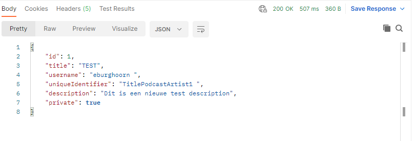

3. Post /playlist -> Maakt een nieuwe playlist aan 
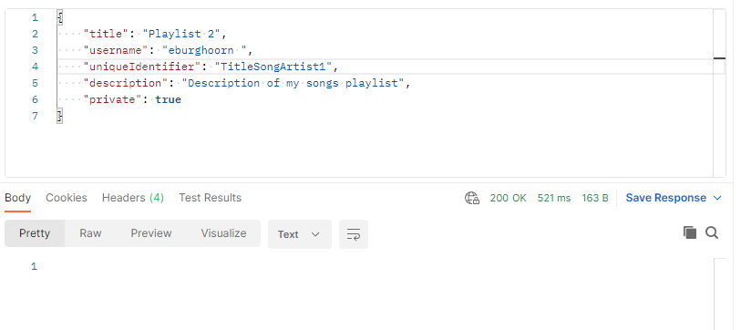

4. Put /playlist/id/{id} -> Past een specifieke playlist aan met de id die je meegeeft
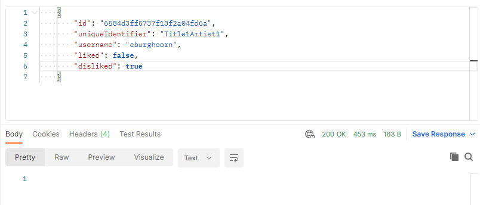

5. Delete /playlist/id/{id} -> Verwijdert een playlist
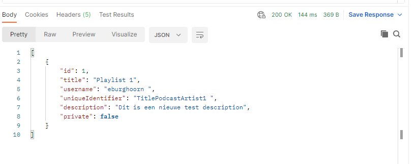

### User-service: 
1. Get /user/username/{username} -> Geeft een gebruiker terug met die specifieke gebruikersnaam
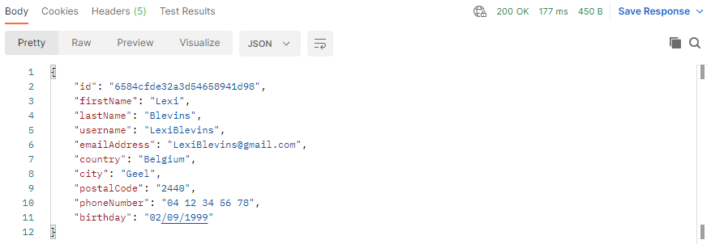

2. Post /user -> Maakt een nieuwe gebruiker aan 
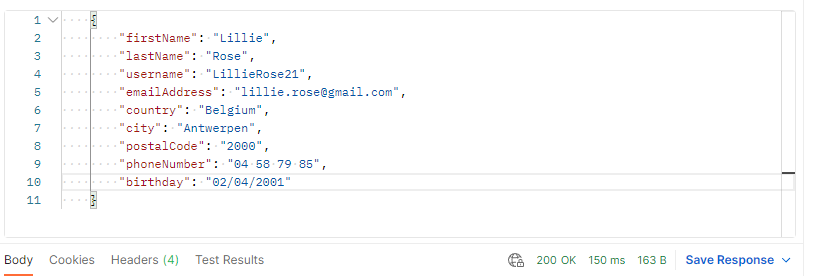

3. Edit /user/username/{username} -> Past een gebruiker zijn informatie aan
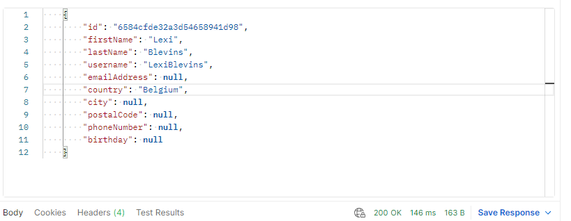

4. Delete /user/username/{username} -> Verwijdert een gebruiker
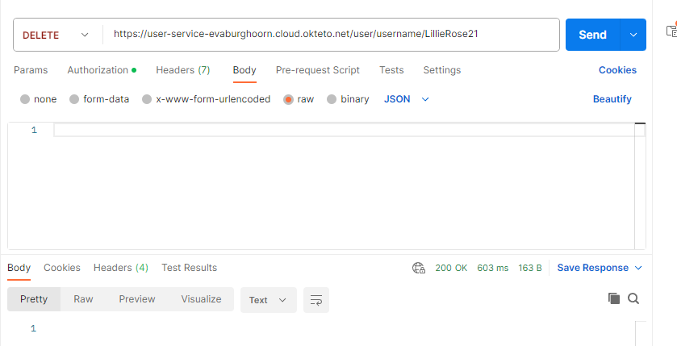

### Musicpodcast-service: 
1. Get /musicpodcast/all -> Geeft alle liedjes en podcasts terug
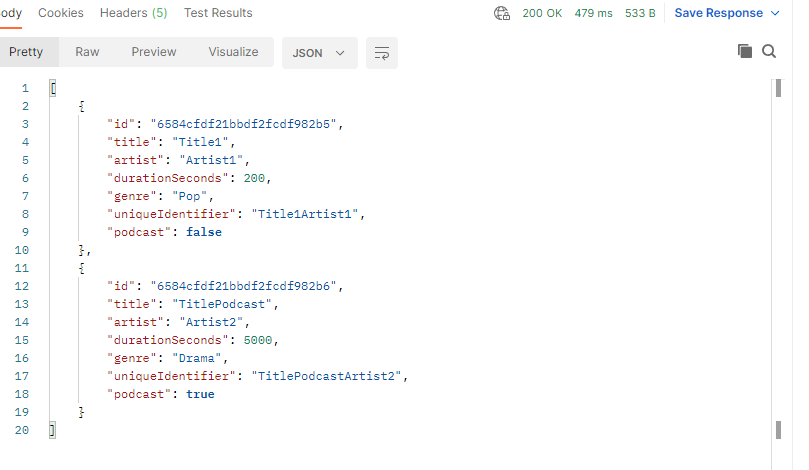

2. Get /musicpodcast/songs -> Geeft alle liedjes terug
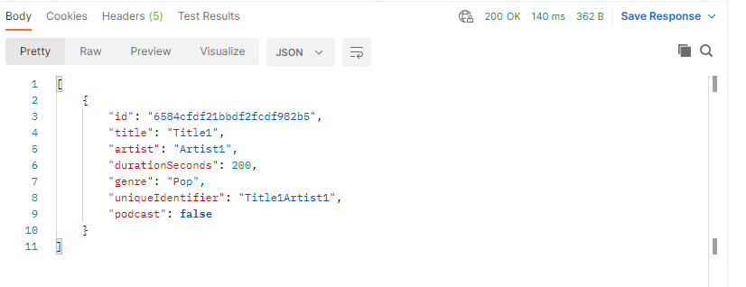

3. Get /musicpodcast/podcasts -> Geeft alle podcasts terug
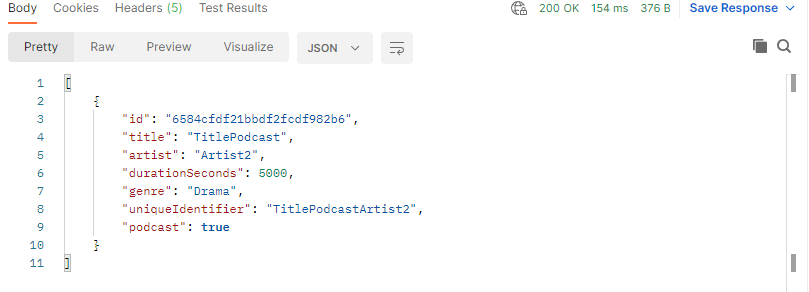

4. Get /musicpodcast/id/{uniqueIdentifier} -> Geeft een music podcast terug met die specifieke unieke identifier

5. Get /musicpodcast/ratings/{username} -> Geeft alle music podcasts terug die een rating hebben die geliked is van een specifieke user die wordt opgehaald door de gebruikersnaam.
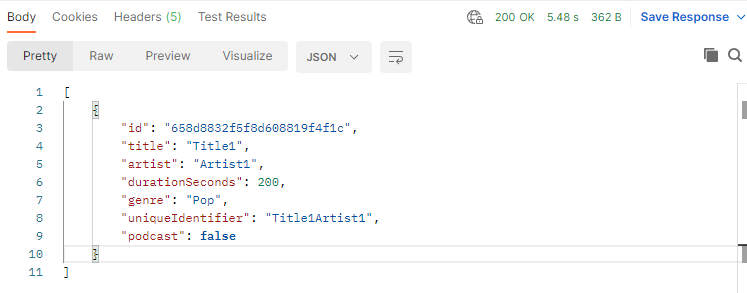

### Rating-service: 
1. Get /rating/username/{username} -> Haalt alle ratings op van een specifieke gebruiker met behulp van de gebruikersnaam
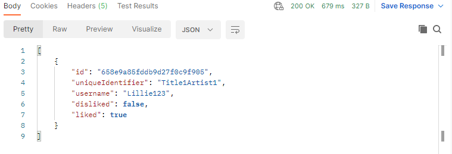

2. Post /rating -> Maakt een nieuwe rating aan
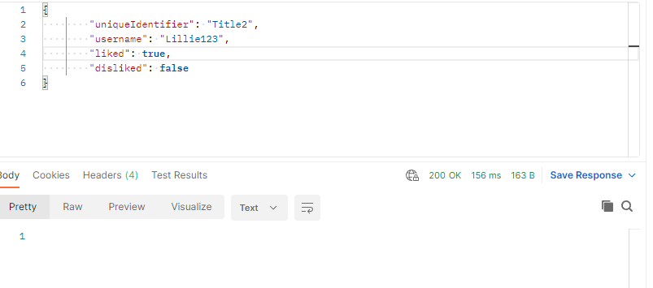

3. Put /rating/id/{id} -> Update een specifieke rating
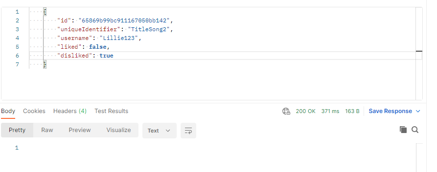

4. Delete /rating/id/{id} -> Verwijdert een rating

## Projectdoelen en Vereisten
Wij hebben ons vooral gefocust op de algemene eisen en de documentatie. Dus hieronder kan je zien wat wij hebben geimplementeerd. 

### Basics:
- Minstens 3 GET, 1 POST, 1 PUT en 1 DELETE endpoints op een API Gateway, gebaseerd op je eigen services. Wij hebben in totaal 9 GET, 3 POST, 3 PUT en 3 DELETE endpoints.
- Minstens 1 keer MongoDB als databank en minstens 1 keer SQL. Wij hebben 3 keer MongoDB en 1 keer SQL databank gebruikt.
- Logisch gebruik van path parameters, query parameters en body.

### Documentatie:
- Beschrijving van het gekozen thema, je microservices en andere componenten zoals gateways in lijst en schema, en je uitbreidingen + link naar de zaken die gehost zijn op GitHub README.md.
- Aantoonbare werking van alle endpoints door screenshots van Postman requests op GitHub README.md.

### Deployment:
- Docker container voor de componenten, welke automatisch door GitHub Actions opgebouwd wordt.
- Deployment van de container(s) op Okteto Cloud via Docker Compose.

### Security:
- Auth op Gateway via GCP OAuth2, met secured/unsecured endpoints.

### Testing:
- Unit testing all the Service classes.
